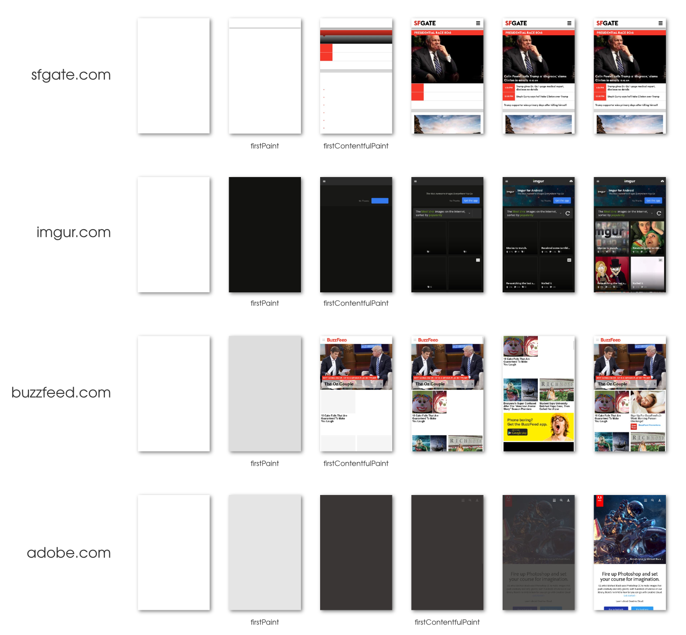

# PerformancePageLoadTiming firstPaint

Web developers require more information on page load performance in the wild. There's no single point in time which represents when a page had loaded – there's a series of key moments during pageload which developers care about.
For detailed motivation, see [Why First Paint doc](https://docs.google.com/document/d/1wdxSXo_jctZjdPaJeTtYYFF-rLtUFxrU72_7h9qbQaM/edit)

See the [`firstContentfulPaint`](https://github.com/tdresser/time-to-first-contentful-paint/blob/master/README.md) explainer for details on another of these moments.

We propose introducing a `PerformancePageLoadTiming` interface extending the [`PerformanceEntry`](https://www.w3.org/TR/performance-timeline-2/#the-performanceentry-interface) interface, which will report the times of these key moments. `PerformancePageLoadTiming` will include a `firstPaint` attribute, which is a `DOMHighResTimeStamp` reporting the time when the browser first painted anything non-white after a navigation.

This is the first key moment developers care about in page load – when the browser has started to render the page.

PerformancePageLoadTiming entries will have a `name` of "document", an `entryType` of "pageload", a `startTime` of 0, and a `duration` of 0. Each entry will have a `firstPaint` attribute, which is a `DOMHighResTimeStamp`.

## Computation of `firstPaint`
The browser has performed a "paint" when it has prepared content to be drawn to the screen.

More formally, we consider the browser to have "painted" a document when it has updated "the rendering or user interface of that Document and its browsing context to reflect the current state". See the HTML spec's section on the event loop processing model – [section 7.12](https://html.spec.whatwg.org/multipage/webappapis.html#event-loop-processing-model).

`firstPaint` reports the time since `navigationStart` until the first time the browser paints anything non-white.

## Using `firstPaint`
`firstPaint` is used by registering a `PerformanceObserver`.

```javascript
var observer = new PerformanceObserver((list) => {
  for (let perfEntry of list.getEntries()) {
    console.log("firstPaint :" + perfEntry.firstPaint);
  }
});

observer.observe({entryTypes: ["pageload"]});
```

## Examples

These examples are hand annotated, based on the definitions given above and in the [`firstContentfulPaint`](https://github.com/tdresser/time-to-first-contentful-paint/blob/master/README.md) explainer.



Some rough bulk data can be seen [here](https://docs.google.com/spreadsheets/d/1i0-tOtZP21m3DjBJflUJYao9-WAKwWV2p9WFlVhVivg/edit#gid=1447332636) or [here](https://docs.google.com/spreadsheets/d/1nGauGA3EvN8NBC3ErWjLd8Bz-NzmmEa6q6UP5KhfgeA/edit#gid=0). This data was collected using a somewhat different definition than we're currently using – it includes white paints in `firstPaint` and only looks at text and image paints for `firstContentfulPaint`.

## TODO
* More rigourously define what we mean by "paint".
